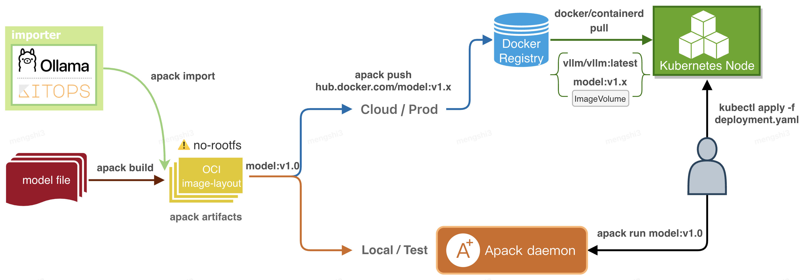

# Assemble and Propagate AI artifacts Containerization on Kubernetes - APACK

[](https://opensource.org/licenses/Apache-2.0)
[](https://opencontainers.org/)

**apack** is a cloud-native AI model packaging and distribution tool designed for the modern AI/ML lifecycle. It containerizes AI models, making them first-class citizens alongside Docker containers, fundamentally transforming how models are delivered, distributed, and executed.

> **Core Value**: Manage AI models like Docker images. Zero learning curve, out-of-the-box experience, enabling standardized version control, build packaging, debugging, and delivery. Build once, run anywhere.

## Core Features

### 100% Cloud-Native Architecture
- **OCI Standard Compliance**: Fully compliant with Open Container Initiative (OCI) standards - model images are container images.
- **Universal Runtime**: Seamlessly compatible with mainstream container runtimes like `docker`, `containerd`, `cri-o`, supporting direct model pulling and mounting.

### Minimalist Operation Experience
- **No Dockerfile Required**: Eliminate complex build configurations. The tool handles underlying details automatically - no need to be a container expert.
- **Built-in Inference Engine**: Out-of-the-box functionality, no complex configuration required. One-click local model execution with built-in (llama.cpp/llamafile) runtime and plugin support for other mainstream frameworks (PyTorch/TensorFlow/ONNX).

### Cost Optimization & Efficiency
- **Smart Layered Packaging**: Leverage OCI's layered storage mechanism, focusing only on changed files and layers (e.g., fine-tuned model weights only).
- **Incremental Updates**: Achieve zero redundancy at node-level model resources, significantly reducing storage footprint and network bandwidth.

### Security & Compliance
- **Full-Chain Packaging**: Package not only model weights but also datasets, inference code, dependencies, and documentation, forming complete product-level AI/ML data chains.
- **Offline Delivery**: Support secure delivery in private, offline environments.
- **Audit-Friendly**: Meet data and model traceability and compliance requirements through image version management.

## Comparative Advantages

| Feature | Traditional Model Deployment | **apack (Model Containerization)** |
| :--- | :--- | :--- |
| **Distribution** | File transfer (tar/zip) / HuggingFace CLI | OCI image pull (Docker/Containerd) |
| **Environment Dependencies** | Manual configuration, prone to inconsistencies | Environment solidify within images, 100% consistency |
| **Update Mechanism** | Full download/overwrite | **Incremental updates**, only transfer differential layers |
| **Local Execution** | Requires Python environment setup | `apack run` direct execution, **built-in engine** |
| **Cloud Production** | Dedicated CLI or scripts | Reuse Docker CLI / Kubernetes |

## Workflow


apack starts from trained model files, analyzes and generates a declarative description file (Apackfile) in the given model directory. This file serves as the build instruction for model images and is stored alongside model files. Users specify this file when building images to create model containers. Images are distributed under oci-image-spec:v1.1, compatible with all image registries and cloud-native container tools like docker and containerd.

1. **Built-in inference engine** enables local execution and debugging without dependency on docker, containerd, or other tools. Zero configuration - the tool is ready to use immediately after download.
2. **Locally debugged model images** can be directly pushed to registries and deployed to the cloud without secondary packaging or intermediate processing.

> [!NOTE]
> Cloud deployment uses Kubernetes `ImageVolume` feature. v1.33/v1.34 require manual enabling of this feature, while [v1.35 enables it by default](https://kubernetes.io/docs/tasks/configure-pod-container/image-volumes/).

## Quick Start

### System Requirements

#### Local Environment
https://github.com/user-attachments/assets/739a7d63-60d8-4110-b326-04ffb68a6c08

| Component | Minimum Requirements | Recommended Configuration |
|-----------|----------------------|---------------------------|
| Operating System | Linux/macOS/Windows | Linux Ubuntu 20.04+ |
| Memory | 4GB RAM | 16GB+ RAM |
| Storage | 10GB free space | 50GB+ SSD |
| Network | Stable internet connection | Bandwidth ≥ 10Mbps |

#### Cloud Environment
https://github.com/user-attachments/assets/f672083c-de0c-4900-b494-5b579d50510f

| Component | Minimum Requirements | Recommended Configuration |
|-----------|----------------------|---------------------------|
| Container Runtime | Docker 20.10+ or Containerd 1.6+ | Docker 24.0+ |
| Kubernetes | v1.33 | v1.35 |
| Operating System | Kernel 4.5 | Kernel 5.1+ |
| Memory | 128GB RAM | 512GB+ RAM |
| Storage | 500GB free space | 5TB+ SSD |
| Network | Enterprise-grade connection | Bandwidth ≥ 100Mbps |
| Image Registry | OCI-compliant registry | Harbor/AWS ECR/Azure ACR |

### Install apack

#### Method 1: Pre-compiled Binaries (Recommended)

<details>
<summary><strong>Linux</strong></summary>

```bash
# AMD64 Architecture
curl -L https://github.com/model-ci/apack/releases/latest/download/apack-linux-amd64 -o apack
https://github.com/model-ci/apack/releases/tag/0.0.1
chmod +x apack
sudo mv apack /usr/local/bin/

# ARM64 Architecture
curl -L https://github.com/model-ci/apack/releases/latest/download/apack-linux-arm64 -o apack
chmod +x apack
sudo mv apack /usr/local/bin/

# Verify installation
apack version
```
</details>

<details>
<summary><strong>macOS</strong></summary>

```bash
# Intel Chip
curl -L https://github.com/model-ci/apack/releases/latest/download/apack-darwin-amd64 -o apack
chmod +x apack
sudo mv apack /usr/local/bin/

# Apple Silicon (M1/M2)
curl -L https://github.com/model-ci/apack/releases/latest/download/apack-darwin-arm64 -o apack
chmod +x apack
sudo mv apack /usr/local/bin/

# Or use Homebrew
brew install model-ci/tap/apack
```
</details>

<details>
<summary><strong>Windows</strong></summary>

```powershell
# PowerShell download
Invoke-WebRequest -Uri "https://github.com/model-ci/apack/releases/latest/download/apack-windows-amd64.exe" -OutFile "apack.exe"

# Add to PATH environment variable
# Or place directly in system PATH directory
```
</details>

#### Method 2: Build from Source

```bash
# Method 1: Download pre-compiled version from GitHub Releases
wget https://github.com/model-ci/apack/releases/latest/download/apack-linux-amd64
chmod +x apack-linux-amd64
sudo mv apack-linux-amd64 /usr/local/bin/apack

# Method 2: Build from source
git clone https://github.com/model-ci/apack.git
cd apack
make build
```

## Documentation

- **[User Guide](docs/user-guide.md)** - Detailed usage instructions and best practices
- **[API Documentation](docs/api.md)** - Complete API interface specifications
- **[Architecture Design](docs/architecture.md)** - System architecture and design philosophy
- **[FAQ](docs/FAQ.md)** - Frequently Asked Questions
- **[Changelog](CHANGELOG.md)** - Version update history

## Examples and Use Cases

- **LLM Deployment**: Production deployment of large language models
- **Research Experiments**: Model version management in AI research
- **Industrial Applications**: Standardized delivery of enterprise AI applications
- **Cloud-Native Integration**: Model services in Kubernetes environments

## Acknowledgments

Special thanks to the following projects and communities:
- [Open Container Initiative (OCI)](https://opencontainers.org/) for standard specifications
- [llama.cpp](https://github.com/ggerganov/llama.cpp) community for the inference engine
- [Go Language Community](https://golang.org/) for excellent development tools
- All contributors and users for valuable feedback
