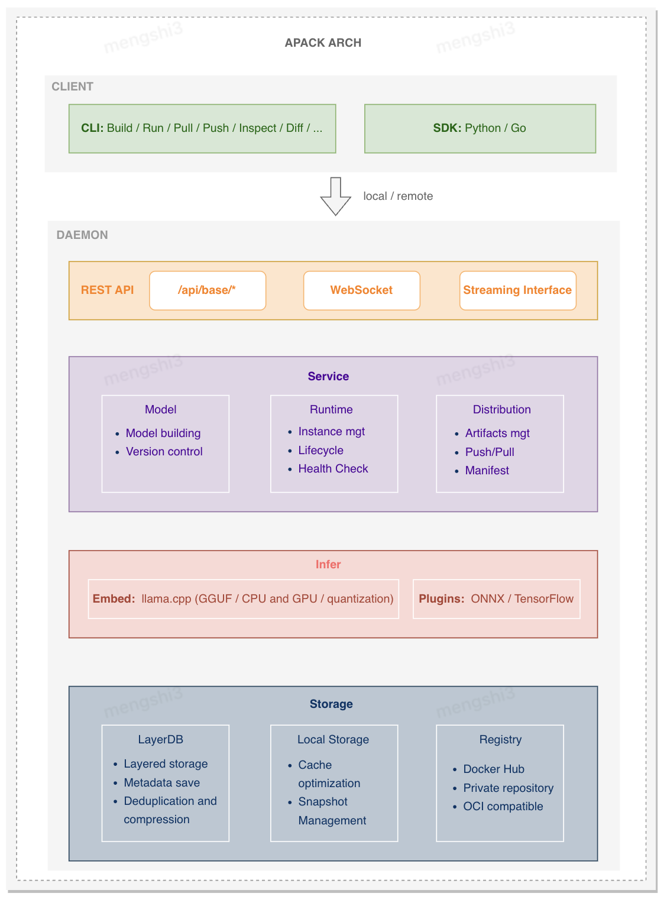

# apack Architecture Design

This document provides a detailed introduction to apack's system architecture, design philosophy, and core components, helping developers deeply understand the project's technical implementation.

## Table of Contents

- [Design Philosophy](#design-philosophy)
- [Overall Architecture](#overall-architecture)
- [Core Components](#core-components)
- [Data Flow](#data-flow)
- [Storage Architecture](#storage-architecture)
- [Network Architecture](#network-architecture)
- [Security Architecture](#security-architecture)
- [Scalability Design](#scalability-design)
- [Performance Optimization](#performance-optimization)

## Design Philosophy

### Core Principles

#### 1. Cloud-Native First
- **OCI Standard Compliance**: Fully compliant with OCI image specifications, ensuring seamless integration with existing container ecosystems
- **Containerized Thinking**: Treat AI models as first-class citizens, managing models like container images
- **Declarative Configuration**: Use Apackfile for declarative model configuration

#### 2. Simplified User Experience
- **Zero-Configuration Startup**: Built-in inference engine, no complex environment setup required
- **Automated Processes**: Fully automated workflow from model analysis to image building
- **Unified Interface**: Provide consistent CLI and API interfaces

#### 3. High Performance and Scalability
- **Layered Storage**: Utilize OCI layering mechanism for incremental updates and storage optimization
- **Concurrent Processing**: Support for multiple model concurrent execution and management
- **Plugin Architecture**: Support for multiple inference engines and model formats

#### 4. Security and Reliability
- **Image Signing**: Support for digital signing and verification of model images
- **Access Control**: Fine-grained permission management and authentication mechanisms
- **Fault Recovery**: Automatic restart and failover mechanisms

## Overall Architecture

### System Architecture


### Layered Architecture

#### 1. Interface Layer
- **CLI Interface**: Command-line tool providing complete model management functionality
- **REST API**: HTTP/HTTPS interface supporting programmatic access
- **Web UI**: Graphical management interface providing visual operations

#### 2. Service Layer
- **Model Manager**: Responsible for model building, version control, and metadata management
- **Runtime Manager**: Manages model instance lifecycle and resource allocation
- **Distribution Manager**: Handles image pulling, pushing, and repository interaction

#### 3. Engine Layer
- **Inference Engine**: Supports multiple AI inference frameworks
- **Adapter Pattern**: Unified interface for different engines
- **Plugin Mechanism**: Support for custom inference engines

#### 4. Storage Layer
- **Layered Storage**: OCI standard-based layered file system
- **Local Cache**: Efficient local storage management
- **Remote Repository**: Integration with standard image registries

## Core Components

### 1. Model Manager

#### Responsibilities
- Model image building and packaging
- Model metadata management and indexing
- Version control and tag management
- Apackfile parsing and validation

#### Core Classes
```go
type Artifact struct {
	OCIVersion string          `json:"ociVersion" yaml:"ociVersion"`
	Package    Package         `json:"package,omitempty" yaml:"package,omitempty"`
	Spec       modelspec.Model `json:"spec,omitempty" yaml:"spec,omitempty"`
}

type Package struct {
	Name      string    `json:"name,omitempty" yaml:"name,omitempty"`
	Workspace string    `json:"workspace,omitempty" yaml:"workspace,omitempty"`
	Reference string    `json:"reference,omitempty" yaml:"reference,omitempty"`
	Size      int64     `json:"size,omitempty" yaml:"size,omitempty"`
	Digest    string    `json:"digest,omitempty" yaml:"digest,omitempty"`
	Models    []Model   `json:"models,omitempty" yaml:"models,omitempty"`
	DataSets  []DataSet `json:"datasets,omitempty" yaml:"datasets,omitempty"`
	Codes     []Code    `json:"codes,omitempty" yaml:"codes,omitempty"`
	Docs      []Doc     `json:"docs,omitempty" yaml:"docs,omitempty"`
}
```

#### Main Workflow
1. **Model Analysis**: Scan model files, identify format and dependencies
2. **Configuration Generation**: Automatically generate or parse Apackfile
3. **Image Building**: Create OCI-compatible model images
4. **Metadata Storage**: Save model information and indexes

### 2. Runtime Manager

#### Responsibilities
- Model instance creation and destruction
- Resource allocation and monitoring
- Health checks and fault recovery
- Load balancing and scaling

#### Core Classes
```go
type Runtime interface {
    Run(ctx context.Context, ref, path string, plog progress.Logger) error
    Kill(ctx context.Context, ref, id string) error
    Ps(ctx context.Context) (*States, error)
}

type runtime struct {
	distribution.Distribution
	infer.Client
}
```

#### Lifecycle Management
1. **Instance Creation**: Create model instances based on configuration
2. **Resource Allocation**: Allocate CPU, memory, GPU, and other resources
3. **Service Startup**: Start inference engine and API services
4. **Health Monitoring**: Continuously monitor instance status
5. **Fault Handling**: Automatic restart or failover
6. **Graceful Shutdown**: Safely stop instances and release resources

### 3. Distribution Manager

#### Responsibilities
- Image pulling and pushing
- Repository authentication and authorization
- Transfer optimization and resumable uploads
- Image signing and verification

#### Core Classes
```go
type Distribution interface {
	Pull(ctx context.Context, remote registry.Repository, ref registry.Reference, log *progress.Logger, opts *Options) (oci.Descriptor, error)
	Push(ctx context.Context, remote registry.Repository, ref registry.Reference, log *progress.Logger, opts *Options) (oci.Descriptor, error)
	Bundle(ctx context.Context, mf Makefile, log *progress.Logger, opts *Options) (oci.Descriptor, error)
	Extract(ctx context.Context, path string, reference string, log *progress.Logger, opts *Options) error
	Artifacts(ctx context.Context) ([]spec.Artifact, error)
	Artifact(ctx context.Context, reference string) (spec.Artifact, error)
	Manifest(ctx context.Context, reference string) (oci.Manifest, oci.Descriptor, error)
	Config(ctx context.Context, desc oci.Descriptor) (layerdb.Config, error)
	Remove(ctx context.Context, reference string) error
	State(ctx context.Context, reference string, desc oci.Descriptor) error
	Statuses(ctx context.Context) ([]oci.Descriptor, error)
	Snapshot(ctx context.Context, reference string) (string, error)
	Snappath(ctx context.Context, reference string) string
	Tag(ctx context.Context, ref1, ref2 registry.Reference) error
}

type local struct {
	db       layerdb.DB
	dbRaw    layerdb.RAW
	snapPath string
}
```

#### Transfer Optimization
- **Layered Transfer**: Only transfer changed layers
- **Concurrent Download**: Multi-threaded concurrent transfer
- **Compression Algorithms**: Use efficient compression algorithms
- **Caching Mechanism**: Intelligent caching strategy

### 4. Inference Engine Adapter

#### Design Pattern
Use adapter pattern to unify interfaces of different inference engines:

```go
type Infer interface {
	Create(*config.ServerConfig, *config.APIConfig) (types.Runner, oci.Descriptor, error)
	Get(id string) (types.Runner, error)
	Close() error
}

type Runner interface {
	Start(ctx context.Context) error
	Stop() error
	IsRunning() bool
	Restart() error

	Complete(ctx context.Context, req *CompletionRequest) (*CompletionResponse, error)
	CompleteStream(ctx context.Context, req *CompletionRequest) (<-chan CompletionChunk, error)
	Chat(ctx context.Context, req *ChatRequest) (*ChatResponse, error)
	ChatStream(ctx context.Context, req *ChatRequest) (<-chan ChatChunk, error)
	Embed(ctx context.Context, req *EmbedRequest) (*EmbedResponse, error)
	Model(ctx context.Context) (*ModelListResponse, error)

	StartAPI(ctx context.Context) error
	StopAPI() error
	IsAPIRunning() bool
	GetApiURL() string

	Health() (*HealthStatus, error)
	Metrics() (*Metrics, error)
	OnEvent(handler EventHandler)
}
```

#### Supported Engines
- **llama.cpp**: High-performance LLM inference engine
- **ONNX Runtime**: Cross-platform machine learning inference
- **TensorFlow Serving**: Enterprise-level model serving
- **PyTorch Serve**: PyTorch model deployment
- **Custom Engines**: Extensible through plugin mechanism

## Data Flow

### 1. Model Building Workflow

```
User Input → Model Analysis → Configuration Generation → Image Building → Metadata Storage → Artifact Snapshot
    ↓              ↓                    ↓                     ↓                 ↓                   ↓ 
Apackfile    Model Format     Auto Configuration           OCI Image         LayerDB           Local Disk
```

#### Detailed Steps
1. **Input Validation**: Validate model files and configuration
2. **Format Recognition**: Automatically identify model format (GGUF, ONNX, etc.)
3. **Layer Building**: Create model layer, runtime layer, configuration layer
4. **Metadata Generation**: Generate OCI manifest and configuration
5. **Storage Optimization**: Deduplication compression and layered storage

### 2. Model Execution Workflow

```
Start Request → Instance Creation → Resource Allocation → Engine Startup  → Service Ready → Request Processing
    ↓                 ↓                      ↓                  ↓                 ↓                ↓
Run Config       Instance Mgmt      Resource Scheduling   Inference Engine  API Service      Load Balancing
```

#### Detailed Steps
1. **Configuration Parsing**: Parse runtime configuration and parameters
2. **Resource Check**: Verify system resource availability
3. **Instance Allocation**: Allocate unique instance ID and resources
4. **Model Loading**: Load model from storage to memory
5. **Engine Initialization**: Initialize inference engine
6. **Service Startup**: Start HTTP/WebSocket service
7. **Health Check**: Verify service availability

### 3. Image Distribution Workflow

```
Local Image → Authentication   →    Layered Upload    →  Manifest Update → Remote Storage
    ↓                 ↓                 ↓                      ↓                 ↓
  LayerDB    Token Verification   Concurrent Transfer     OCI Manifest     Image Registry
```

## Storage Architecture

### 1. Layered Storage Design

#### OCI-Compatible Layered Structure
```
Image Manifest (Manifest)
├── Configuration Layer (Config Layer)
│   ├── Runtime configuration
│   ├── Environment variables
│   └── Startup parameters
├── Runtime Layer (Runtime Layer)
│   ├── Inference engine binary
│   ├── System dependencies
│   └── Runtime libraries
├── Model Layer (Model Layer)
│   ├── Model weight files
│   ├── Model configuration
│   └── Vocabulary files
└── Metadata Layer (Metadata Layer)
    ├── Model information
    ├── License
    └── Documentation
```

#### Storage Optimization
- **Content Addressing**: Hash-based deduplication storage
- **Compression Algorithms**: Use efficient compression like gzip, zstd
- **Incremental Updates**: Only store and transfer changed layers
- **Garbage Collection**: Automatically clean up unused layers and images

### 2. LayerDB Design

#### Database Structure
```go
type DB interface {
	OCI
	Raw(opt *Options) (RAW, error)
	GC(ctx context.Context) error
	Close() error
}

type OCI interface {
	Index(ctx context.Context, reference string, desc oci.Descriptor) error
	Manifest(ctx context.Context, reference string) (oci.Manifest, oci.Descriptor, error)
	Manifests(ctx context.Context) ([]oci.Manifest, []string, error)
	Copy(ctx context.Context, ref1, ref2 string) error
	Read(ctx context.Context, desc oci.Descriptor) (io.ReadCloser, error)
	Write(ctx context.Context, desc oci.Descriptor, content io.ReadCloser, progress io.Writer) error
	Set(ctx context.Context, desc oci.Descriptor, content io.ReadCloser) error
	Layering(ctx context.Context, mediaType string, content, snap *os.File, progress io.Writer) (oci.Descriptor, digest.Digest, error)
	Contenting(ctx context.Context, mediaType string, content *os.File, progress io.Writer) (io.ReadCloser, error)
	Content(ctx context.Context, desc oci.Descriptor, diffid digest.Digest, content io.ReadCloser) (io.Reader, error)
	Delete(ctx context.Context, reference string) error
	Snap(ctx context.Context, reference string) error
	Purge(ctx context.Context, reference string) error
	Exists(ctx context.Context, desc oci.Descriptor) (bool, error)
}

type RAW interface {
	Put(ctx context.Context, key, value string) error
	Get(ctx context.Context, key string) ([]byte, error)
	PutStream(ctx context.Context, key string, data io.ReadCloser) error
	GetStream(ctx context.Context, key string) (io.ReadCloser, error)
	ForEach(ctx context.Context, fn func(key, value []byte) error) error
}
```

#### Storage Backends
- **Local Filesystem**: Default local storage backend
- **Object Storage**: Support for S3, OSS, and other cloud storage
- **Distributed Storage**: Support for HDFS, Ceph, and other distributed systems
- **Memory Storage**: For testing and temporary storage

### 3. Cache Strategy

#### Multi-level Cache
1. **Memory Cache**: Hot data caching for fast access
2. **Local Disk**: SSD local cache
3. **Network Storage**: Remote cache cluster

#### Cache Policies
- **LRU Eviction**: Least Recently Used eviction policy
- **Preloading**: Predictive model preloading
- **Smart Prefetching**: Usage pattern-based prefetching
- **Compressed Storage**: Compressed cache data storage

## Network Architecture

### 1. Communication Protocols

#### Supported Protocols
- **HTTP/HTTPS**: Standard REST API
- **WebSocket**: Real-time bidirectional communication

#### Protocol Optimization
- **HTTP/2**: Multiplexing and server push
- **Compressed Transfer**: gzip, zstd, and other compression algorithms
- **Connection Reuse**: TCP connection reuse and keep-alive
- **SSL/TLS**: End-to-end encrypted transmission

### 2. Registry Integration

#### Supported Registries
- **Docker Hub**: Public image registry
- **Harbor**: Enterprise-grade registry
- **AWS ECR**: Amazon Elastic Container Registry
- **Azure ACR**: Azure Container Registry
- **GCP GCR**: Google Container Registry

#### Authentication Methods
- **Basic Auth**: Username/password authentication
- **Token-based**: JWT token authentication
- **OAuth2**: OAuth 2.0 authentication flow
- **AWS IAM**: AWS Identity and Access Management

### 3. Network Optimization

#### Transfer Protocol
- **HTTP/2**: Multiplexed connections for better performance
- **QUIC**: Experimental support for QUIC protocol
- **Compression**: On-the-fly data compression
- **Chunked Transfer**: Efficient large file transfer

#### Connection Pooling
- **Connection Reuse**: Reuse established connections
- **Timeout Management**: Configurable connection timeouts
- **Retry Mechanism**: Automatic retry on network failures

## Security Architecture

### 1. Authentication & Authorization

#### Authentication Methods
- **API Key**: Simple API key authentication
- **Bearer Token**: JWT-based token authentication
- **mTLS**: Mutual TLS for enhanced security
- **OIDC**: OpenID Connect integration

#### Authorization Model
```go
type Permission struct {
    Resource string   // Resource type
    Action   string   // Operation type
    Scope    []string // Permission scope
}

type Role struct {
    Name        string
    Permissions []Permission
}

type User struct {
    ID       string
    Username string
    Roles    []Role
}
```

#### RBAC Design
- **User**: System users
- **Role**: Collections of permissions
- **Permission**: Specific operation permissions
- **Resource**: Protected system resources

### 2. Image Security

#### Image Signing
- **Content Trust**: Notary-based image signing
- **Signature Verification**: Automatic signature verification during pull
- **Key Management**: Secure key storage and rotation
- **Audit Logging**: Complete signing and verification logs

#### Vulnerability Scanning
- **Static Scanning**: Security scanning during build
- **Dynamic Scanning**: Runtime vulnerability detection
- **Dependency Analysis**: Security analysis of third-party dependencies
- **Compliance Check**: Security compliance validation

### 3. Network Security

#### Network Isolation
- **Network Segmentation**: Network isolation between different components
- **Zero Trust Architecture**: Identity-based access control

#### Data Encryption
- **Transport Encryption**: TLS/SSL encrypted transmission
- **Storage Encryption**: Encrypted storage of data at rest
- **Key Management**: Centralized key management
- **End-to-End Encryption**: Complete encryption chain

## Scalability Design

### 1. Plugin System

#### Plugin Architecture
```go
type Plugin interface {
	Process(ctx *fasthttp.RequestCtx) (blocked bool, err error)
}

type InfoProvider interface {
	GetInfo() *PluginInfo
}

type Configurable interface {
	Configure(config map[string]string) error
}

type PluginInfo struct {
	Name         string   `json:"name"`
	Version      string   `json:"version"`
	Description  string   `json:"description"`
	Capabilities []string `json:"capabilities"`
}

type AdvancedPlugin interface {
	Plugin
	InfoProvider
	Configurable

	Initialize() error
	Start() error
	Stop() error

	HealthCheck() error

	GetMetrics() map[string]interface{}
}
```

#### Plugin Management
- **Dynamic Loading**: Runtime plugin loading and unloading
- **Version Management**: Plugin version control and upgrades
- **Dependency Management**: Automatic resolution of plugin dependencies
- **Sandbox Isolation**: Secure isolated execution of plugins

### 2. Client/Server Service Architecture

#### Daemon Side
- **API Service**: Support for command tools, SDK, and other integration methods
- **Process Isolation**: Multi-model runtime isolation and state management
- **Event Stream**: Server-side support for streaming task events
- **Distributed**: Support for multi-node deployment and distributed artifact distribution

#### Client Side
- **User-friendly Commands**: Commands support dynamic state event awareness
- **Asynchronous Processing**: Support for command exit and background execution mode

### 3. Horizontal Scaling

#### Stateless Design
- **API Services**: Stateless API servers for easy scaling
- **Load Balancer**: Distributed load balancing
- **Service Discovery**: Dynamic service registration and discovery

#### State Management
- **External Storage**: Store state in external databases
- **Session Affinity**: Client affinity for stateful services
- **Cache Cluster**: Distributed caching solution

### 4. Vertical Scaling

#### Resource Management
- **CPU Scaling**: Dynamic CPU allocation
- **Memory Management**: Efficient memory usage
- **GPU Support**: GPU resource allocation and sharing

#### Performance Optimization
- **Connection Pooling**: Database connection pooling
- **Query Optimization**: Optimized database queries
- **Indexing**: Efficient data indexing strategies

## Performance Optimization

### 1. Computational Optimization

#### Artifact Distribution
- **Build Snapshot**: Build computational metadata, snapshot artifacts, save space, improve utilization
- **Metadata Pre-reading**: Push-time pre-reading technology, stream computing during artifact package push, compression, packaging
- **Smart Layering**: Hash-based file granularity layer cutting, faster continuous layer stacking technology

### 2. Memory Optimization

#### Memory Management
- **Memory Pool**: Pre-allocated memory pool management
- **Zero-copy**: Reduce unnecessary memory copying
- **Memory Mapping**: Memory-mapped access for large files
- **Garbage Collection**: Intelligent memory garbage collection

#### Cache Optimization
- **Multi-level Cache**: L1/L2/L3 multi-level cache strategy
- **Preloading**: Intelligent data preloading
- **Compressed Storage**: Compressed cache data storage
- **Eviction Policy**: Efficient cache eviction algorithms

### 3. I/O Optimization

#### Storage Optimization
- **SSD Optimization**: Optimization strategies for SSD
- **Concurrent I/O**: Multi-threaded concurrent I/O operations
- **Asynchronous I/O**: Non-blocking asynchronous I/O
- **Batch Operations**: Batch processing of I/O operations

#### Network Optimization
- **Connection Reuse**: HTTP connection reuse
- **Compressed Transfer**: Compressed data transmission

### 4. Model Loading Optimization

#### Lazy Loading
- **On-demand Loading**: Load model components as needed
- **Memory Mapping**: Use memory-mapped files for large models
- **Pre-fetching**: Predictive model component loading

#### Caching Strategy
- **Model Cache**: Cache loaded models in memory
- **Weight Cache**: Cache model weights for faster access
- **Result Cache**: Cache inference results

### 5. Inference Optimization

#### Batch Processing
- **Request Batching**: Batch multiple inference requests
- **Parallel Execution**: Parallel model execution
- **Pipeline Processing**: Pipeline model inference stages

#### Hardware Acceleration
- **GPU Utilization**: Optimize GPU usage
- **Tensor Cores**: Leverage tensor core acceleration
- **Quantization**: Model quantization for faster inference

### 6. Storage Optimization

#### Deduplication
- **Content-based**: Deduplicate identical data blocks
- **Layer Sharing**: Share common layers between images
- **Delta Encoding**: Store only differences between versions

#### Compression
- **Lossless Compression**: Efficient compression algorithms
- **Progressive Loading**: Load data progressively as needed
- **Sparse Storage**: Optimize storage for sparse data

---

*This architecture document will be continuously updated as the project evolves. For questions, please check [GitHub Issues](https://github.com/model-ci/apack/issues) or contact the architecture team.*